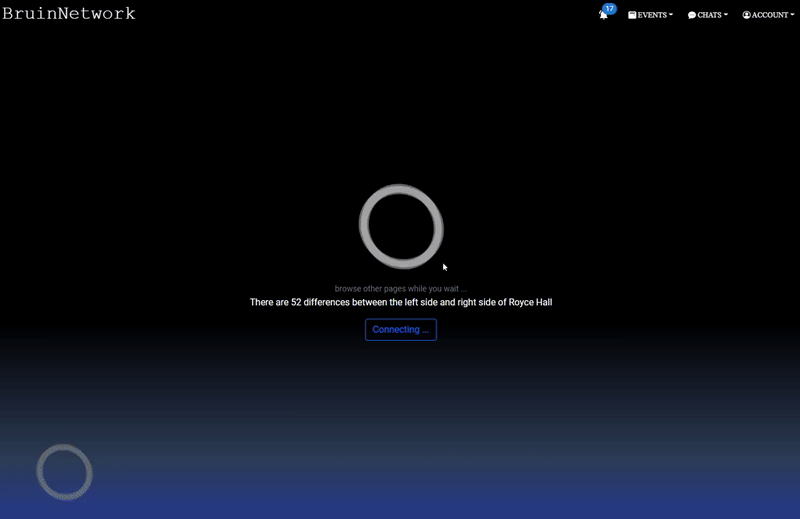
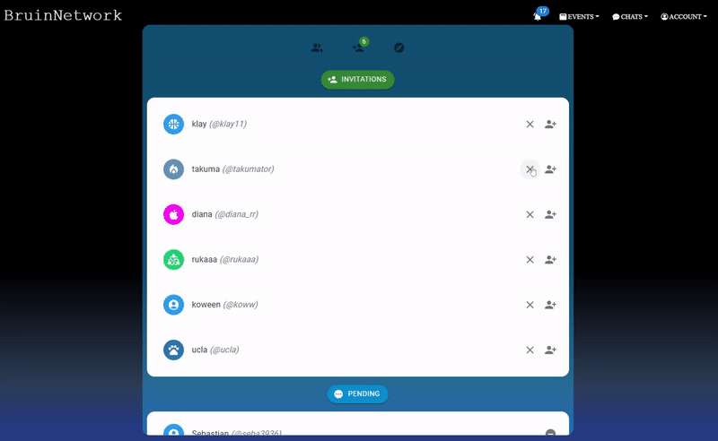
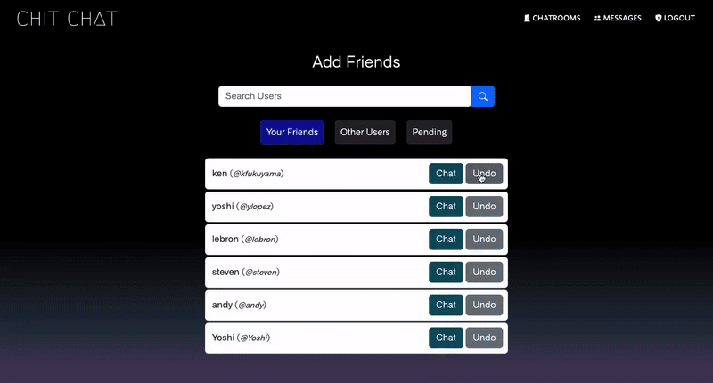
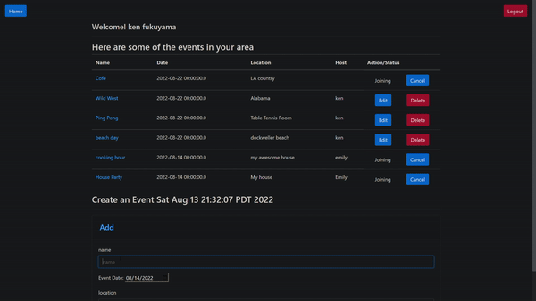

<h2 align="center" style="margin-bottom: 1rem; margin-top: 1rem;">

 <strong> - About Me - </strong>

</h2>

 
Hi, I am Ken Fukuyama, a full stack developer and software engineer!   
At UCLA, I am studying various subjects in computer science and data science. I am passionate about creating software that makes people's lives better and easier. My experiences include full stack software development, SQL/NoSQL database management, and machine learning algorithm implementation.

     Feel free to connect with me on <a href="https://www.linkedin.com/in/kenfukuyama/">LinkedIn</a> or send me an email (<em>kenfukuyama.12@gmail.com</em>).

  

<!-- 

  

 -->

<h2 align="center" style="margin-bottom: 1rem; margin-top: 1rem;">
 
 <strong> - Projects - </strong>

</h2>

<h3 align="center">
BruinNetwork - Full stack social network site for students	
</h3>

<!-- 
(Live Site: <a href="http://bruinnetwork.com">bruinnetwork.com</a>)
-->

  

    
    
   
  

  <a href="https://github.com/kenfukuyama/BruinNetwork/blob/master/README.md">GitHub README: BruinNetwork</a>

<h3 align="center">
Chit Chat - Full Stack Instant Messaging Application in Java (Live Site: <a href="https://kb.chit-chat.link">kb.chit-chat.link</a>)

</h3>

  

    
    
  

  <a href="https://github.com/kenfukuyama/chitchat/blob/main/README.md">GitHub README: Chit Chat</a>

<h3 align="center">

Event Management - CRUD Application Using Java Spring Boot Framework

</h3>

  

  <a href="https://github.com/kenfukuyama/Event-Planner-App">GitHub Repo: Event App</a>

<!--
**kenfukuyama/kenfukuyama** is a ✨ _special_ ✨ repository because its `README.md` (this file) appears on your GitHub profile.

Here are some ideas to get you started:

- 🔭 I’m currently working on ...
- 🌱 I’m currently learning ...
- 👯 I’m looking to collaborate on ...
- 🤔 I’m looking for help with ...
- 💬 Ask me about ...
- 📫 How to reach me: ...
- 😄 Pronouns: ...
- ⚡ Fun fact: ...
-->
